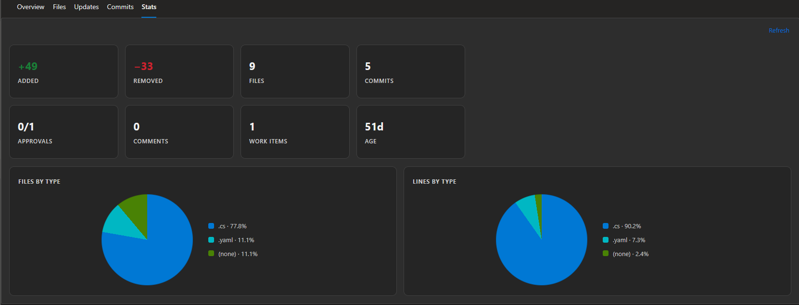

# ADO Lens

A tiny Chrome and Firefox extension that adds a Stats tab to Azure DevOps pull requests and opens a detailed dashboard with PR metrics.

It shows:

- lines added and removed
- files and commits
- reviewer approvals
- check/status results
- comments, linked work items, and PR age

## Demo



The extension has **no** background worker, third-party service, or analytics. It makes same-origin Azure DevOps REST requests with the session already active in the page. Diff metadata and line-diff blocks are processed in memory and are never persisted. If the per-file diff service is unavailable, the extension falls back to comparing file contents in memory. Large and binary files are skipped and marked as partial in the UI. Browser sync storage is used only for extension settings.

## Project layout

- `chrome/` — Chrome manifest and build script
- `firefox/` — Firefox manifest and build script
- `shared/` — shared runtime code, settings page, and tests

## Stats

| Displayed stat | What it measures | Source |
| --- | --- | --- |
| Added | Lines added across changed files | Azure DevOps per-file diff data, using [`FileDiff.lineDiffBlocks`](https://learn.microsoft.com/en-us/javascript/api/azure-devops-extension-api/filediff) and [`LineDiffBlock.modifiedLinesCount`](https://learn.microsoft.com/en-us/javascript/api/azure-devops-extension-api/linediffblock); the extension sums the counts locally |
| Removed | Lines removed across changed files | Azure DevOps per-file diff data, using [`FileDiff.lineDiffBlocks`](https://learn.microsoft.com/en-us/javascript/api/azure-devops-extension-api/filediff) and [`LineDiffBlock.originalLinesCount`](https://learn.microsoft.com/en-us/javascript/api/azure-devops-extension-api/linediffblock); the extension sums the counts locally |
| Files | Number of changed files in the PR diff | Azure DevOps [commit diff API](https://learn.microsoft.com/en-us/rest/api/azure/devops/git/diffs/get?view=azure-devops-rest-7.1) |
| Commits | Number of commits associated with the pull request | Azure DevOps [Pull Request Commits API](https://learn.microsoft.com/en-us/rest/api/azure/devops/git/pull-request-commits?view=azure-devops-rest-7.1) |
| Approvals | Reviewers with an approving vote compared with total reviewers | Azure DevOps [Get Pull Request API](https://learn.microsoft.com/en-us/rest/api/azure/devops/git/pull-requests/get-pull-request?view=azure-devops-rest-7.1) |
| Comments | Non-deleted, non-system comments in the pull request | Azure DevOps [Pull Request Threads API](https://learn.microsoft.com/en-us/rest/api/azure/devops/git/pull-request-threads?view=azure-devops-rest-7.1); comments are filtered locally |
| Work items | Work items linked to the pull request | Azure DevOps [Pull Request Work Items API](https://learn.microsoft.com/en-us/rest/api/azure/devops/git/pull-request-work-items?view=azure-devops-rest-7.1) |
| Age | Days since the pull request was created | `creationDate` from Azure DevOps [Get Pull Request API](https://learn.microsoft.com/en-us/rest/api/azure/devops/git/pull-requests/get-pull-request?view=azure-devops-rest-7.1), calculated locally |
| Files by type | Percentage of changed files grouped by extension | File paths from the Azure DevOps [commit diff API](https://learn.microsoft.com/en-us/rest/api/azure/devops/git/diffs/get?view=azure-devops-rest-7.1), grouped locally |
| Lines by type | Percentage of added plus removed lines grouped by extension | Azure DevOps per-file line-diff blocks, grouped locally by file extension; falls back to the [Git items API](https://learn.microsoft.com/en-us/rest/api/azure/devops/git/items/list?view=azure-devops-rest-7.1) when needed |

The displayed metrics are not scraped from the rendered Azure DevOps page. The extension reads the current PR URL and uses the page DOM only to place and synchronize the native-looking Stats tab and content view.

## Build packages

Run the browser-specific script from the repository root:

```powershell
.\chrome\build.ps1
.\firefox\build.ps1
```

The uploadable ZIP files are created in `chrome/dist/` and `firefox/dist/`. Each ZIP has `manifest.json` at its root and includes the icons generated from `store-assets/source/ado-lens-logo.png`. The Firefox package includes the required built-in data-collection declaration.

## Load unpacked

### Chrome

1. Open `chrome://extensions`.
2. Enable **Developer mode**.
3. Extract the Chrome ZIP from `chrome/dist/`.
4. Choose **Load unpacked** and select the extracted package folder.

### Firefox

1. Open `about:debugging`.
2. Select **This Firefox**.
3. Select **Load Temporary Add-on**.
4. Extract the Firefox ZIP from `firefox/dist/` and select its `manifest.json`.

Then open or reload an Azure DevOps pull request.

The Stats tab appears beside the PR navigation tabs. Select it to open the dashboard. Open **ADO Lens settings** from the browser toolbar icon to show or hide the Stats tab; the setting syncs through the browser.

## Tests

```powershell
node .\shared\tests\lib.test.js
```
## Contributing

Pull requests and issue reports are welcome. They are reviewed by maintainers, but a response, merge, or fix is not guaranteed.

## AI disclosure

AI was used to write portions of the code in this project. All code is tested by the maintainers.
